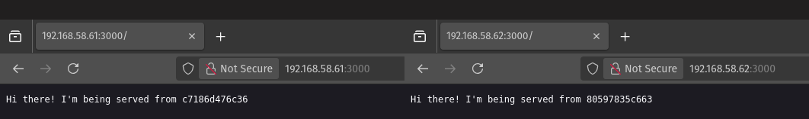

# DevOps Engineer - Technical Test - Solution - Stanislaus Cristo

Welcome to the DevOps Engineer Technical Test Solution! 
This is the solution to the DevOps Engineer Technical Test by Stanislaus Cristo to create automated infrastructure and CI/CD pipelines while adhering to modern DevOps methodologies.

---

## Objective

The task is to create a CI build pipeline that deploys this Node.js web application to a load-balanced environment and can be completed by locally using tools like Docker or on a cloud provider of your choice.

---

## Requirements

### CI Build Pipeline

1. **Trigger Mechanism**:  
   - The CI job should trigger automatically when a feature branch is pushed to GitHub.  
   - If working locally, implement an alternative method to trigger the pipeline.

2. **Deployment Workflow**:  
   - The CI pipeline should test and deploy the application to the target environment after a successful build.

---

### Target Environment

The environment must meet the following specifications:

1. **Load Balancer**:
   - Accessible via HTTP on port 80.
   - Configured to use a **round-robin** strategy to distribute traffic between application servers.

2. **Application Servers**:
   - Two instances running this web application.
   - Each accessible via HTTP on port 3000.
   - The application must respond with:  
     `Hi there! I'm being served from {hostname}!`

---

## Tools and Technologies Used

The tools used for this task are:

- **CI Services**: GitHub Actions
- **Local Environment**: Docker, Vagrant, VMWare Workstation Provider
- **Machine Providers**: Local machine
- **Load Balancers**: NGINX
- **Version Control**: GitHub

---

## Execution Plan
The execution plan for this task are as below:
1. Check the Node.js web application locally without any virtual machines to ensure that the application passes the required test.
1. Create and provision three virtual machines with Vagrant, with the names:
   - NGINX: to serve as load balancer for the application servers
   - applicationInstance1: first virtual machine for Node.js web application
   - applicationInstance2: second virtual machine for Node.js web application
2. Check NGINX server configurations after the virtual machines are created and provisoned
3. Create two Github Actions runners to use as the CI pipeline for each virtual machine
4. Created two Github Actions workflow:
   - To push the docker image to Docker Hub
   - To deploy the application to each Runner in a docker image
5. Check web applications

---

## Solution

Before creating the solution, the following softwares are installed:
1. Docker
2. Vagrant
3. VMWare Workstation Provider
4. Vagrant VMWare Utility

### 1. Checked the Node.js Web Application Locally Without any Virtual Machines
1. Run the command 'npm test'
2. Found fault in 'Chai' used for the application due to not complying with Commonjs syntax
3. Reverted 'Chai' to version '4.5.0' in the [package-lock.json](package-lock.json) file
4. Run the command 'npm audit fix' to fix any vulnerabilities found due to reverting 'Chai'
   
### 2. Create and Provision Three Virtual mMchines with Vagrant
1. Created the virtual machines Vagrant with the command ´vagrant up´. Vagrant will use the provided [Vagrantfile](Vagrantfile) in this repository and will automotically provision the virtual machines
2. Checked the virtual machine status with the command ´vagrant status´ to ensure the virtual machines have been created and are currently running

### 3. Check NGINX Server Configurations After the Virtual Machines are Created and Provisioned
1. SSH to the virtual machine named "nginx" with the command ´ssh nginx´
2. Checked NGINX server configuration with the command:
   ´´´
   cat /etc/nginx/nginx.conf | grep "include /etc/nginx/sites-"
   ´´´
3. Checked the configuration of the load balancer by checking whether the file **load_balancer.conf** exists in the directory **/etc/nginx/conf.d/**, if not use [load_balancer.conf](load_balancer.conf) provided in this repository
4. Restarted the NGINX service, with the command ´sudo systemctl restart nginx´

### 4. Create Two Github Actions Runners to Use as CI Pipeline
1. SSH to each virtual machine created for each application instance.
2. In the [Settings](https://github.com/stacristo/ntx-devops-test/settings) of this repository there is a section under "Actions" called [Runners](https://github.com/stacristo/ntx-devops-test/settings/actions/runners)
3. Selected "New self-hosted runner" and followed the instructions given by Github for each self-hosted runner for each virtual machine.
4. Made sure that the status of each Github Runner status is in ´idle´, this will change to 'running' when there are jobs given to each Runner.

### 5. Created Two Github Actions Workflow
1. The first workflow is [push-docker-image.yml](.github/workflows/push-docker-image.yml). This is a workflow run on the local machine to push a docker image to Docker Hub
2. The second workflow is [deploy.yml](.github/workflows/deploy.yml). This is to deploy the Node.js web applicaction to the created Github Actions Runners and run the web application in a docker image in each virtual machine.

### 6. Check Web Applications
1. SSH to each virtual machine for the web application
2. Checked whether [deploy.yml](.github/workflows/deploy.yml) successfuly deployed the docker image to each instance
   ´´´
   docker ps -a | grep ntx-devops-test
   ´´´
3. If the container is running, checked whether the application is also running by accessing the IP for the web application defined in the Vagrantfile. This will show the Node.js web application ´Hi there! I'm being served from {hostname}!´
   
   
---

## Disclaimer
1. Cloud deployment was attempted in Amazon Web Services (AWS), but changed to local deployment due to storage constraints for Jenkins
2. Jenkins was not used for local deployment due to local machine storage constraints also
3. Manual tasks that was done for this task:
  - Definining the IPs for the three virtual machines
  - Creating the Github Actions Runner for each web application instance still needed to SSH to each server manually 
